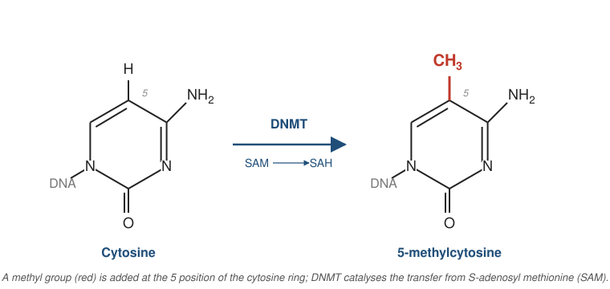

# The Biochemistry and Biology of DNA Methylation

Section 1 of 3. Sections 2 and 3 cover DNA methylation in cancer and the
bio-technology of methylated DNA immunoprecipitation, respectively.

## What is DNA methylation?

- In mammals, "DNA methylation" almost always refers to **5-methylcytosine (5mC)**: a methyl group covalently attached to the C5 position of the cytosine pyrimidine ring.
- The reaction is enzymatic, post-replicative, and reversible.
- 5mC is sometimes called the "fifth base" — it does not change Watson–Crick base pairing but profoundly alters how DNA is read by proteins.
- *N*6-methyladenine (6mA) exists in mammals but at very low abundance; its biological significance is still debated. Bacteria use 5mC and 6mA prominently in restriction–modification systems.
- 5-hydroxymethylcytosine (5hmC), 5-formylcytosine (5fC), and 5-carboxylcytosine (5caC) are oxidation products of 5mC and serve as demethylation intermediates — and, in the case of 5hmC, possibly as stable marks in their own right.

## DNA methylation: the chemical reaction

{width=92%}

- The change is small: one hydrogen replaced by one methyl group, on the carbon at position 5 of the ring.
- Watson–Crick base-pairing with guanine is unaffected — 5mC pairs with G just as cytosine does.
- What changes is **how the DNA is read**: methyl-CpG-binding proteins recognise the methyl group, and certain transcription factors no longer bind their motifs when CpGs in them are methylated.

## The CpG context

- Mammalian 5mC occurs almost exclusively at **CpG dinucleotides** — a cytosine immediately 5′ of a guanine on the same strand.
- CpG is **palindromic**: a CpG on one strand pairs with a CpG on the other. This symmetry is the structural basis for clonal inheritance of methylation through cell division.
- Non-CpG (CpH, where H = A/C/T) methylation does occur in embryonic stem cells and post-mitotic neurons, but the bulk of methylation biology in somatic tissues — and essentially all of cfMeDIP-seq — concerns CpG methylation.
- The human genome contains roughly **28 million CpG sites**; ~70–80% are methylated in a typical somatic cell.

## CpG islands and CpG depletion

- 5mC spontaneously deaminates to **thymine** (rather than to uracil, as unmethylated cytosine does), and T:G mismatches are repaired with lower fidelity than U:G. Over evolutionary time this has **depleted CpGs** from the bulk genome.
- Observed genome-wide CpG frequency is ~20% of what GC content alone would predict.
- **CpG islands (CGIs)** are short (~200 bp – 2 kb) regions where this depletion has *not* occurred — GC-rich, CpG-rich, and **predominantly unmethylated** in normal cells.
- Roughly 70% of annotated gene promoters overlap a CGI.
- Surrounding regions are conventionally classified as **CpG shores** (≤2 kb flanking), **shelves** (2–4 kb flanking), and **open sea** (everything else). Shores often carry more dynamic, tissue-specific methylation than the islands themselves.

## The DNMT enzyme family

- **DNMT1** — *maintenance* methyltransferase. Strongly prefers hemimethylated CpG. Recruited to replication forks via **UHRF1**, which reads the parental hemimethylated mark and the H3K9me3 histone mark.
- **DNMT3A** and **DNMT3B** — *de novo* methyltransferases. Establish methylation patterns during early development and during cellular differentiation.
- **DNMT3L** — catalytically inactive but stimulates DNMT3A/B; essential for germline imprint establishment.
- **DNMT2** — despite the name, methylates a cytosine in tRNA-Asp, not DNA. Listed for completeness.
- The maintenance / *de novo* distinction is useful but not absolute: DNMT1 has measurable *de novo* activity, and DNMT3A/B contribute to maintenance at some loci.

## Biochemistry: SAM-dependent methyl transfer

- All DNMTs use **S-adenosyl-L-methionine (SAM, AdoMet)** as the methyl donor.

$$\text{Cytosine} + \text{SAM} \;\xrightarrow{\text{DNMT}}\; \text{5-methylcytosine} + \text{SAH}$$

- The catalytic mechanism involves a covalent enzyme–DNA intermediate: a conserved cysteine in the catalytic motif attacks C6 of the flipped-out cytosine, activating C5 for methyl transfer from SAM.
- **One-carbon metabolism** — folate, methionine, B12, choline, and betaine — feeds the SAM pool. This couples DNA methylation to nutritional and metabolic state, and underlies many epidemiological links between diet and the methylome.
- SAH is a product inhibitor; the **SAM:SAH ratio** ("methylation potential") often matters as much as absolute SAM concentration.

## Maintenance vs. *de novo* establishment

- **Replication-coupled maintenance.** When DNA replicates, the parental strand carries 5mC; the newly synthesized daughter strand does not. The resulting hemimethylated CpG is recognized by UHRF1, which recruits DNMT1 to restore symmetric methylation. Patterns are clonally inherited — but fidelity is imperfect (~96–99% per division), allowing slow drift.
- ***De novo* establishment.** DNMT3A/B place methyl marks at previously unmethylated CpGs. This is dominant during:
    - Pre-implantation development, after global demethylation of the zygote
    - Germline imprint establishment in oocytes and spermatocytes
    - Lineage commitment during differentiation
- In adult somatic cells both activities co-exist, but maintenance dominates quantitatively.

## Demethylation: passive and active

- **Passive demethylation.** If DNMT1 activity is impaired or excluded (as in the early zygote), methylation is diluted by half with each replication cycle.
- **Active demethylation** is enzymatic and replication-independent. **TET1/2/3** (Ten-Eleven Translocation dioxygenases) iteratively oxidize 5mC:

$$\text{5mC} \;\xrightarrow{\text{TET}}\; \text{5hmC} \;\xrightarrow{\text{TET}}\; \text{5fC} \;\xrightarrow{\text{TET}}\; \text{5caC}$$

- **TDG** (thymine DNA glycosylase) excises 5fC and 5caC; **base excision repair** restores unmodified cytosine.
- **5hmC** is enriched in brain and embryonic stem cells. Whether it is solely an intermediate or also a stable epigenetic mark in its own right is still actively debated.
- **Methodological caveat relevant to later sections.** Antibody- and bisulfite-based assays — including MeDIP — generally do not cleanly distinguish 5mC from 5hmC. This matters when interpreting cfMeDIP-seq data from tissues with appreciable 5hmC content.

## Reading the mark

- Methylated CpGs are recognized by proteins with **methyl-CpG binding domains (MBDs)**: MeCP2, MBD1, MBD2, MBD3, MBD4.
- Binding recruits **co-repressor complexes** — NuRD, Sin3A, histone deacetylases (HDACs), histone methyltransferases (e.g., SUV39H, G9a) — that establish repressive chromatin.
- Methylation also **directly excludes** certain transcription factors whose binding motifs contain a CpG (e.g., many bZIP and ETS family factors).
- Some factors *prefer* methylated motifs (e.g., KAISO; certain KLF and homeodomain proteins), so "methylation = silencing" is a useful first approximation, not a universal rule.
- The functional readout depends on **genomic context**: promoter, enhancer, gene body, repeat element, or imprinting control region.

## Functional and biological roles

- **Promoter CGI methylation** → stable transcriptional silencing. Canonical examples: X-chromosome inactivation; tumor-suppressor silencing in cancer.
- **Gene-body methylation** correlates *positively* with expression of actively transcribed genes — the opposite of the promoter rule. Mechanism is thought to involve splicing fidelity and suppression of cryptic intragenic transcription.
- **Repeat element methylation** silences LINE-1, SINE, and endogenous retroviruses, suppressing transposition and aberrant transcription. Loss of repeat methylation contributes to genomic instability.
- **Genomic imprinting.** ~150 imprinted genes in humans are monoallelically expressed in a parent-of-origin manner, controlled by differentially methylated imprinting control regions established in the germline.
- **X-chromosome inactivation.** One X is silenced in female cells; CGI methylation locks in the inactive state.
- **Cell-type identity.** Tissue-specific methylation patterns — particularly at enhancers and CpG shores — are a defining feature of cellular identity, and the basis for methylation-based cell-of-origin and tissue-of-origin inference in liquid biopsy.

## Summary

- 5mC at CpG dinucleotides is the dominant mammalian DNA methylation mark.
- Written by DNMT1 (maintenance) and DNMT3A/B (*de novo*) using SAM as the methyl donor.
- Erased passively by replication or actively by TET-mediated oxidation followed by base excision repair.
- Read by MBD-containing proteins and integrated with chromatin modification.
- Functionally tied to gene silencing, imprinting, X-inactivation, repeat suppression, and cell-type identity.
- These patterns are stable enough to be inherited mitotically yet plastic enough to record cellular history — the property that makes the methylome attractive for both basic biology and liquid biopsy.
