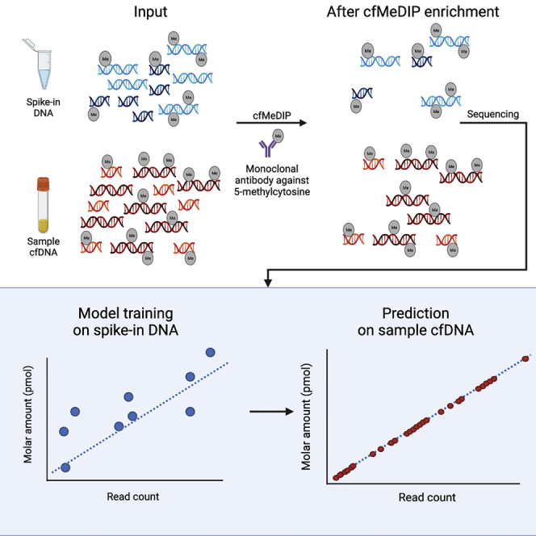
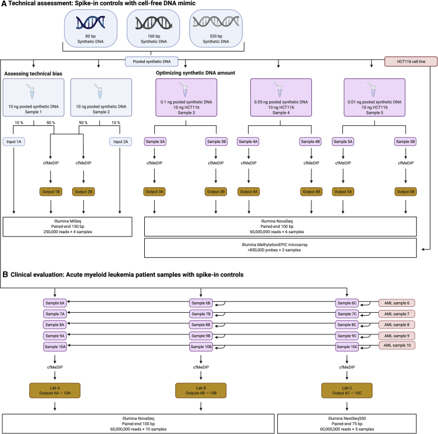
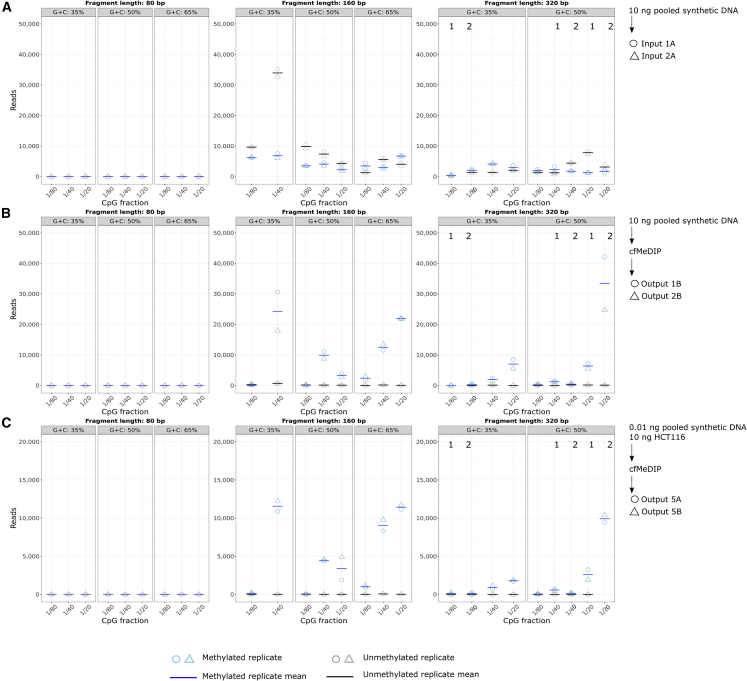
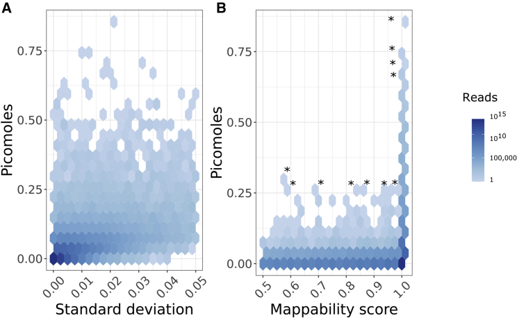
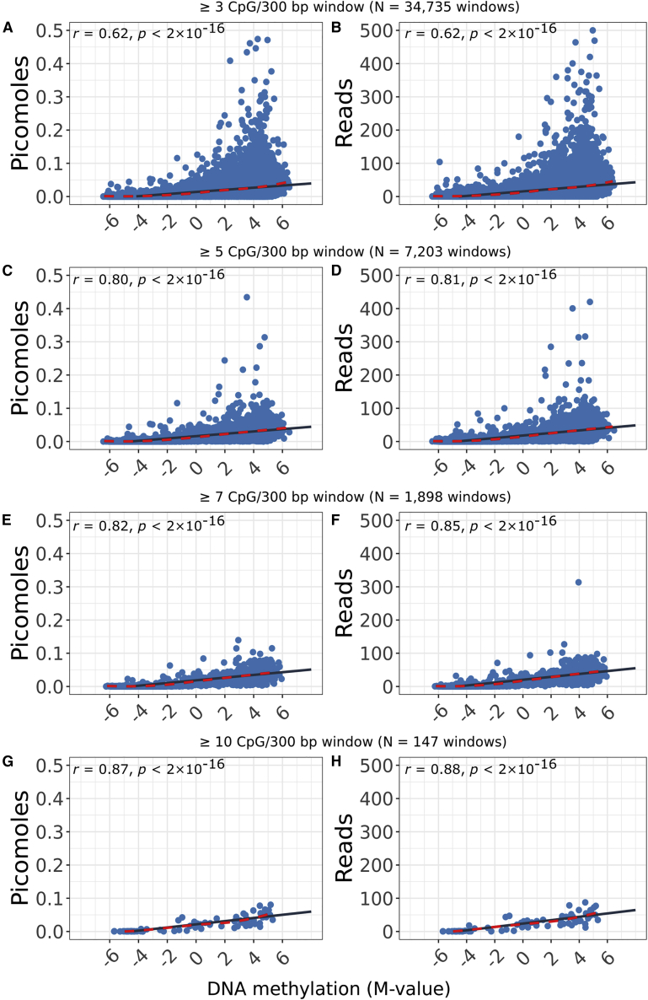
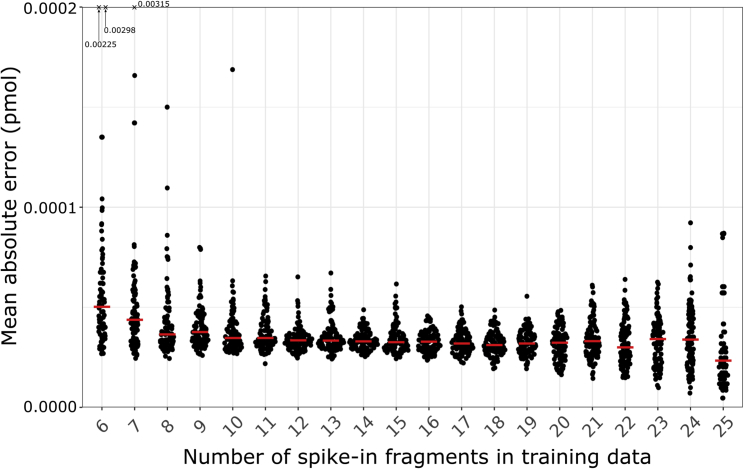
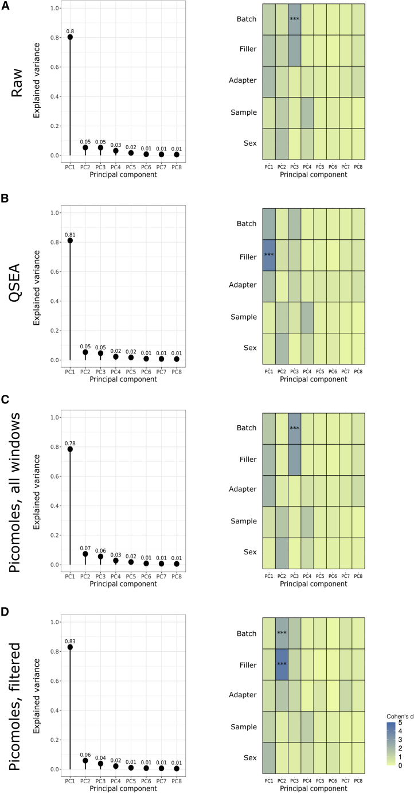

```{css sidenote, echo = FALSE}

.main-container {
    margin-left: 250px;
}
.sidenote, .marginnote { 
  float: right;
  clear: right;
  margin-right: -40%;
  width: 37%;         # best between 50% and 60%
  margin-top: 0;
  margin-bottom: 0;
  font-size: 1.1rem;
  line-height: 1.3;
  vertical-align: baseline;
  position: relative;
  }
```


<style>
@import url('https://fonts.googleapis.com/css?family=Raleway');
@import url('https://fonts.googleapis.com/css?family=Oxygen');
@import url('https://fonts.googleapis.com/css?family=Raleway:bold');
@import url('https://fonts.googleapis.com/css?family=Oxygen:bold');

.main-container {
  max-width: 1400px !important;
}

body{
  font-family: 'Oxygen', sans-serif;
  font-size: 16px;
  line-height: 24px;
}

h1,h2,h3,h4 {
  font-family: 'Raleway', sans-serif;
}

.container { width: 1400px; }

caption {
  font-size: 20px;
  caption-side: top;
  text-indent: 30px;
  background-color: lightgrey;
  color: black;
  margin-top: 5px;
}

g-table-intro h4 {
  text-indent: 0px;
}
</style>

```{r setup, include = FALSE}
knitr::opts_chunk$set(echo = TRUE,
                      comment = NA,
                      warning = FALSE,
                      error = FALSE,
                      message = FALSE,
                      cache = FALSE,
                      fig.width = 8,
                      fig.height = 4)
```

```{r m2b-GlobalOptions, results="hide", include=FALSE, cache=FALSE}

knitr::opts_knit$set(stop_on_error = 2L) #really make it stop
options(knitr.table.format = 'html')

options(stringsAsFactors=F)

 #knitr::dep_auto()

```
<!-- ######################################################################## -->


```{r m2b-Prelims,  include=FALSE, echo=F, results='hide', message=FALSE} 

FN <- "_Wilson_2022_Critical_Analysis_Biological_Validation"
if(sum(grepl(FN, list.files()))==0) stop("Check FN")

 suppressMessages(require(rmarkdown))
 suppressMessages(require(knitr))

 suppressPackageStartupMessages(require(methods))
 suppressPackageStartupMessages(require(bookdown))

 suppressPackageStartupMessages(require(data.table))
 options(datatable.fread.datatable=F)

 suppressPackageStartupMessages(require(plyr))
 suppressPackageStartupMessages(require(dplyr))
 suppressPackageStartupMessages(require(magrittr))

 # Shotcuts for knitting and rendering while in R session (Invoke interactive R from R/Scripts folder)
 kk <- function(n='') knitr::knit2html(paste("t", n, sep=''), envir=globalenv(),
       output=paste(FN,".html", sep=''))

 rr <- function(n='') rmarkdown::render(paste("t", n, sep=''), envir=globalenv(),
       output_file=paste(FN,".html", sep='')) ##, output_dir='Scripts')

 bb <- function(n='') browseURL(paste(FN,".html", sep=''))

 # The usual shortcuts
 zz <- function(n='') source(paste("t", n, sep=''))


 WRKDIR <- '..'
 if(!file.exists(WRKDIR)) stop("WRKDIR ERROR", WRKDIR)

 # file rmarkdown file management options: cache, figures
 cache_DIR <- file.path(WRKDIR,'Scripts', 'cache/M2B/')
 suppressMessages(dir.create(cache_DIR, recursive=T))
 opts_chunk$set(cache.path=cache_DIR)

 figures_DIR <- file.path(WRKDIR,'Scripts', 'figures/M2B/')
 suppressMessages(dir.create(figures_DIR, recursive=T))
 opts_chunk$set(fig.path=figures_DIR)

 #tables_DIR <- file.path(WRKDIR,'Scripts', 'tables/M2B/')
 #suppressMessages(dir.create(table_DIR, recursive=T))
 #opts_chunk$set(fig.path=table_DIR)
 
 # need a local copy of help_DIR
 #help_DIR <- file.path(WRKDIR,'Scripts', 'help_files')
 help_DIR <- file.path('.', 'help_files')
 suppressMessages(dir.create(help_DIR, recursive=T))
 
 temp_DIR <- file.path(WRKDIR,'Scripts', 'temp_files')
 suppressMessages(dir.create(temp_DIR, recursive=T))

```
<!-- ######################################################################## -->

*** 

```{r m2b-utilityFns, echo=F, eval=FALSE}
 # Here we define some utility functions
source('r/utilityFns.r')

```

<!-- ######################################################################## -->


```{r m2b-input-params-all, echo = FALSE, results = "asis", eval=F, echo=F,
 # print out original input params
data.frame(
param_name=names(params),
param_value=unlist(params),
param_class=sapply(params, class), row.names=NULL) %>%
  knitr::kable(caption="Input Parameters")
```


<style>
    hr {
        border: none;
        height: 2px;
        background: none;
        box-shadow: 0 2px 5px rgba(0,0,0,0.5);
    }
</style>


---

# Graphical Abstract

```{r get-abs, eval=F, echo=F, DO_ONCE=T}

wget -O _Wilson_2022_Figures/graph_abs.jpg https://cdn.ncbi.nlm.nih.gov/pmc/blobs/18a8/9499995/c9cf3f5c916a/fx1.jpg 

```



**Caption:** Wilson et al. developed synthetic DNA controls for normalizing cell-free methylation DNA immunoprecipitation sequencing (cfMeDIP-seq) assays used in liquid biopsies. These spike-in controls allow absolute quantification of methylated cell-free DNA in picomoles rather than arbitrary read counts. They also adjust for batch effects and reduce systematic noise related to technical biases.

---

# Figure 1 - Experimental Design

```{r get-fig-1, eval=F, echo=F, DO_ONCE=T}
wget -O _Wilson_2022_Figures/fig-1.jpg https://cdn.ncbi.nlm.nih.gov/pmc/blobs/18a8/9499995/a78845db6b5e/gr1.jpg

```
 


**Figure 1. Experimental design using synthetic spike-in control DNA**

(A) Technical assessment of the spike-in controls with cfDNA mimic. 
  - (Left) Assessment of technical bias in solely the spike-in controls. 
  - (Right) Optimization of the synthetic DNA amount using sheared HCT116 cfDNA mimic.

(B) Clinical evaluation of acute myeloid leukemia (AML) patient samples with spike-in controls.

---

# Figure 2 - Technical Biases Assessment


```{r get-fig-2, eval=F, echo=F, DO_ONCE=T}
wget -O _Wilson_2022_Figures/fig-2.jpg https://cdn.ncbi.nlm.nih.gov/pmc/blobs/18a8/9499995/17d0f592d7cc/gr2.jpg

```



**Figure 2. Assessing biases in fragment length, G + C content, and CpG fraction**

(A–C) In (A) input spike-in control DNA without cfMeDIP-seq, (B) output spike-in control DNA, after cfMeDIP-seq, and (C) 0.01 ng spike-in control DNA added to HCT116 replicates.

Blue, methylated fragments; gray, unmethylated fragments. Circle, sample 1; triangle, sample 2. Solid line, mean of the two samples. Columns marked with numerals 1 and 2 represent alternative sets of fragments with identical properties but different sequences.

See also Table S2.

---

# Figure 3 - Read Distribution in Genomic Windows

```{r get-fig-3, eval=F, echo=F, DO_ONCE=T}
wget -O _Wilson_2022_Figures/fig-3.jpg https://cdn.ncbi.nlm.nih.gov/pmc/blobs/18a8/9499995/6cd01a2af674/gr3.jpg

```



**Figure 3. Two-dimensional histograms of the number of reads found in 300 bp windows**

(A and B) Binned by molar amount and either (A) standard deviation of molar amount or (B) Umap k100 multi-read mappability.

Histograms only include windows that do not overlap with UCSC simple repeats and the ENCODE blacklist, and regions with Umap k100 multi-read mappability scores ≤0.5. Asterisks indicate 11 outlier genomic windows chosen for further examination.

---

# Figure 4 - Correlation with EPIC Array

```{r get-fig-4, eval=F, echo=F, DO_ONCE=T}
wget -O _Wilson_2022_Figures/fig-4.jpg https://cdn.ncbi.nlm.nih.gov/pmc/blobs/18a8/9499995/4f9569cfa1e5/gr4.jpg

```



**Figure 4. Correlation of two measurements of fragment methylation by cfMeDIP and EPIC array M-value for 300 bp genomic windows**

(A, C, E, and G) Molar amount calculated from HCT116 samples correlated to EPIC array M-values.

(B, D, F, and H) Read counts calculated from the same samples, ignoring the spike-in controls.

- (A and B) 37,714 windows with ≥3 CpG probes represented on the EPIC array.
- (C and D) 7,975 windows with ≥5 CpG probes represented on the EPIC array.
- (E and F) 2,066 windows with ≥7 CpG probes represented on the EPIC array.
- (G and H) 158 windows with ≥10 CpG probes represented on the EPIC array.

Solid black line, linear model of best fit; dashed red line, loess (Cleveland 1979) local regression.

---

# Figure 5 - Model Accuracy Assessment

```{r get-fig-5, eval=F, echo=F, DO_ONCE=T}
wget -O _Wilson_2022_Figures/fig-5.jpg https://cdn.ncbi.nlm.nih.gov/pmc/blobs/18a8/9499995/3cccb4a8cd6a/gr5.jpg

```



**Figure 5. Mean absolute error between known molar amount and predicted molar amount in test data consisting of held-out spike-ins not used for training**

For each number of spike-in fragments between 6 and 25 inclusive, we 100 times randomly selected that number of spike-ins as training data. We used the remaining spike-ins as test data. Each point shows the mean absolute error over all the test spike-ins for that iteration. The vertical limits of the plot include at least 98/100 iterations in every case. We denote outliers for 6 or 7 training spike-ins with a cross at the top of the plot, labeled with the mean absolute error for that case.

Red line denotes median mean absolute error.

See also Table S6.

---

# Figure 6 - Batch Effect Mitigation


```{r get-fig-6, eval=F, echo=F, DO_ONCE=T}
wget -O _Wilson_2022_Figures/fig-6.jpg https://cdn.ncbi.nlm.nih.gov/pmc/blobs/18a8/9499995/49611595b438/gr6.jpg

```




**Figure 6. Principal component analyses of cfMeDIP results normalized through four different strategies, and associations with experimental variables**

(Left) Proportion of the variance explained by each principal component. 
(Right) Association between known variables, both technical and clinical, and principal component. Cohen's *d* is an effect size of standardized means between variable. ***p < 0.001.

(A) Raw read counts without any normalization.

(B) Read counts normalized using QSEA.

(C) Data normalized using spike-in controls.

(D) Data normalized using spike-in controls and removing regions in UCSC simple repeats, in the ENCODE blacklist, and with Umap k100 multi-read mappability scores ≤0.5.

See also Tables S3, S4, and S5.

---

# Key Figure Insights

## Technical Performance
- **Figure 2** demonstrates that cfMeDIP-seq achieves 97% methylation specificity with ≤0.01% non-specific binding
- Enrichment shows preference for 160 bp fragments (due to size selection), higher G+C content, and higher CpG fraction

## Quantification Accuracy
- **Figure 4** shows strong correlation between spike-in normalized molar amounts and EPIC array M-values (r = 0.62 to 0.82, depending on CpG density)
- **Figure 5** demonstrates high prediction accuracy with mean absolute error ≤0.002 pmol

## Batch Effect Correction
- **Figure 6** shows that spike-in controls reduce batch-associated variance to ≤1% of total variance
- Most effective when combined with filtering of problematic genomic regions

---

# Citation

Wilson SL, Shen SY, Harmon L, Burgener JM, Triche T Jr, Bratman SV, De Carvalho DD, Hoffman MM. Sensitive and reproducible cell-free methylome quantification with synthetic spike-in controls. Cell Rep Methods. 2022 Sep 9;2(9):100294. doi: 10.1016/j.crmeth.2022.100294. PMID: 36160046; PMCID: PMC9499995.


<!-- To run
## nohup Rscript -e "knitr::knit2html('_Wilson_2022_Figures_Captions.Rmd')" > _Wilson_2022_Figures_Captions.log  &

## Or
## nohup Rscript -e "rmarkdown::render('_Wilson_2022_Figures_Captions.Rmd')" > _Wilson_2022_Figures_Captions.log  &

-->


